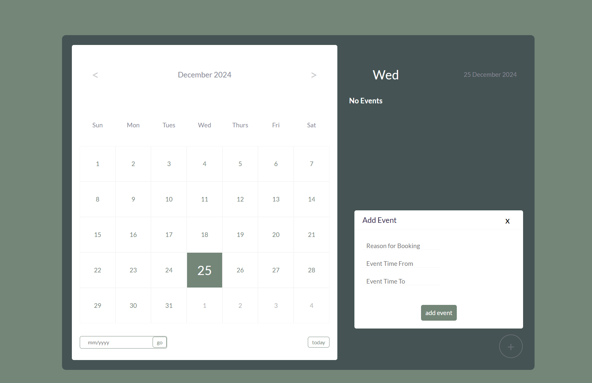

# Events Calendar Manager

A simple and minimalistic calendar application to manage and organize events efficiently. This application offers an interactive interface, event scheduling, and seamless navigation through months and years, making it the perfect tool for personal use.

## Features

- 📅 **Interactive Calendar**: View and navigate through months and years
- 📝 **Event Management**: Add, view, and delete events with ease
- ⏰ **Time Input**: Specify start and end times for events with validation
- 🌟 **Highlight Active Days**: Days with events are visually distinct
- 🔄 **Today Button**: Quickly navigate back to the current date
- 🔍 **Date Navigation**: Jump to any month and year using the date input
- 💾 **Persistent Storage**: Events are stored in the browser's local storage for future access

## How it looks

## Main Feature

1. **Add an Event**:
    - Click the "Add Event" button
    - Enter the event title and specify the time range
    - Click "Submit" to save the event

2. **View Events**:
    - Click on a date with events to view them in the event details panel

3. **Delete an Event**:
    - Click the checkmark button next to an event and confirm the deletion

4. **Navigate Calendar**:
    - Use the left and right arrows to navigate through months
    - Use the "Today" button to return to the current date
    - Use the date input field to jump to a specific month and year
  
## How to use
    https://github.com/nehakhan12/calendar-web-app.git
   - simply clone the repo and open it in your IDE such as VSCode, then you can run the HTML file and it should be working!
